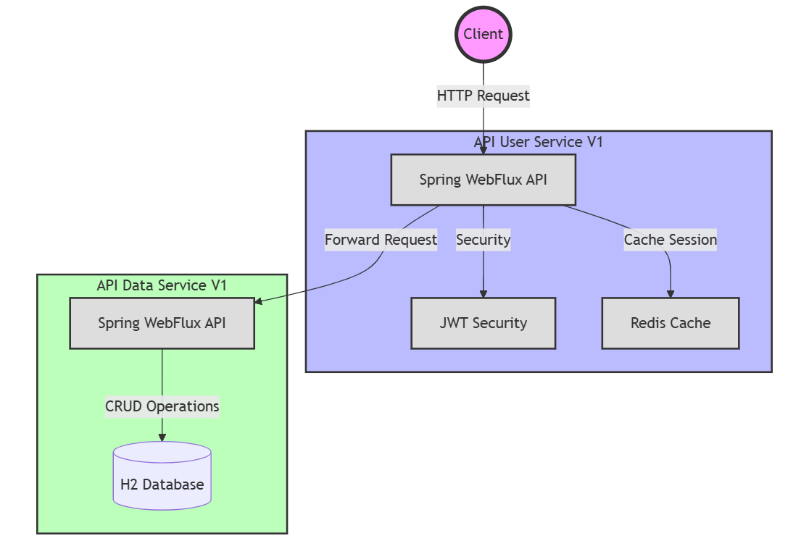
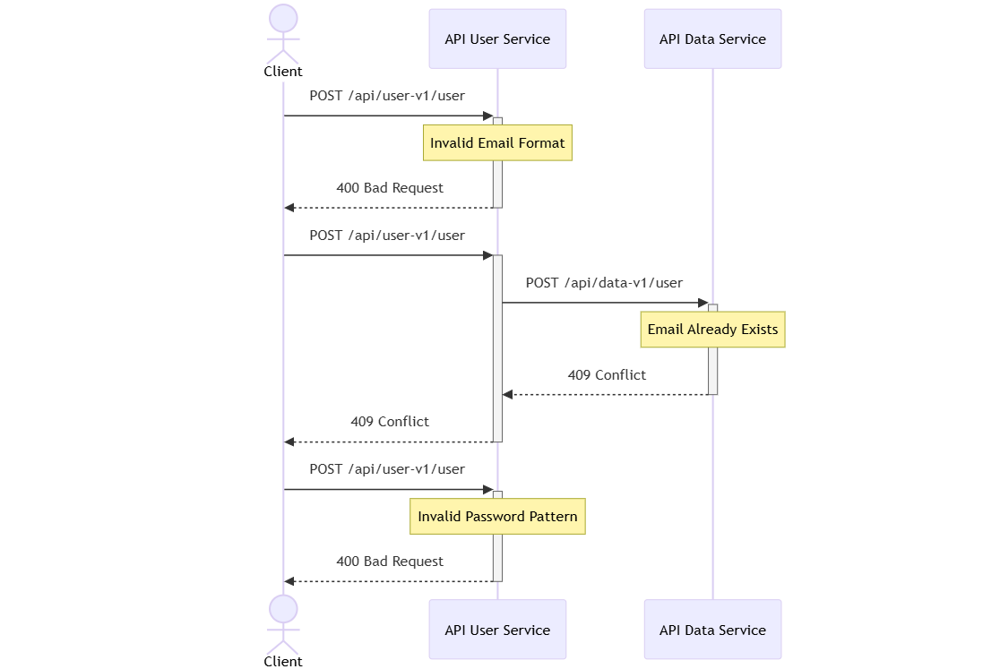
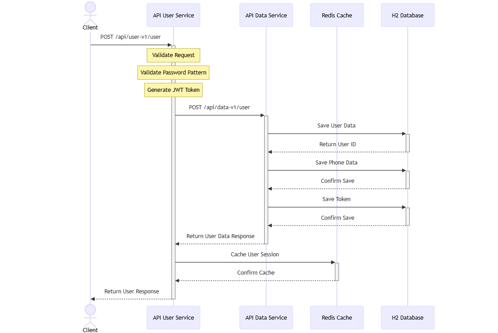

# API User Management

A microservices-based user management system built with Spring WebFlux, featuring Redis caching and JWT authentication.

## 📋 Project Overview

This project consists of two main microservices:

### API User Service (api-user-v1)
- **Description**: Handles user authentication and session management
- **Key Features**:
  - User registration validation
  - Password generation (Bcrypt) and pattern verification
  - JWT token generation
  - Redis session caching
  - Security middleware

### API Data Service (api-data-v1)
- **Description**: Manages user data persistence and retrieval in H2 database
- **Key Features**:
  - User data storage 
  - Phone number management
  - Token storage
  - Email validation
  - Reactive database operations

## 🏗 Architecture



## 📊 Diagram sequence
### 01. Diagram Sequence  validation flow and error




### 02. Diagram Sequence





## 🛠 Technologies

- Java 17
- H2 & r2dbc
- Lombok
- Spring JPA
- Spring Boot 3.4.1
- Spring WebFlux (Reactive)
- Spring Security
- Redis
- Docker & Docker Compose
- JWT Authentication
- Junit 5 and Mockito
- OpenAPI Documentation


## ✨ Features

- User Registration
- Generate JWT Token Security
- Redis Data Persistence
- Reactive Endpoints
- Docker Support
- Password Validation
- Validation email
- API Documentation

## 🚀 Getting Started

### 📚 Prerequisites

- Docker and Docker Compose
- Java 17 (for development)
- Maven 3.6 (for development)

## 🔒 Security Configuration

The API implements security restrictions where most endpoints require authentication. Only the following endpoints are publicly accessible:

- `POST /user` - User registration
- `GET /openapi` - API documentation

All other endpoints are unauthorized

## 💾 Database Schema

The application uses H2 database which is automatically created on startup. The schema is defined in `schema.sql` and includes the following tables:
### Tables Structure

```sql
# Users Table
CREATE TABLE IF NOT EXISTS users (
    user_id BIGINT AUTO_INCREMENT PRIMARY KEY,
    name VARCHAR(255),
    email VARCHAR(255),
    password VARCHAR(255),
    active BOOLEAN,
    created TIMESTAMP,
    modified TIMESTAMP,
    last_login TIMESTAMP,
    token VARCHAR(255)
);

# Phones Table
CREATE TABLE IF NOT EXISTS phones (
    phone_id BIGINT AUTO_INCREMENT PRIMARY KEY,
    number VARCHAR(255),
    city_code VARCHAR(255),
    country_code VARCHAR(255),
    user_id BIGINT,
    FOREIGN KEY (user_id) REFERENCES users(user_id)
);

# Tokens  Table
CREATE TABLE IF NOT EXISTS tokens (
    token_id BIGINT AUTO_INCREMENT PRIMARY KEY,
    token VARCHAR(255),
    user_id BIGINT,
    active BOOLEAN,
    created TIMESTAMP,
    FOREIGN KEY (user_id) REFERENCES users(user_id)
);
```
### Database Configuration
The schema is automatically created when the application starts. This is configured in application.yml:
```yaml
spring:
  sql:
    init:
      mode: always
      schema-locations: classpath:schema.sql
```

## ⚙️Environment Variables
### Variables:
```
SERVER_PORT: 80
SPRING_DATA_REDIS_HOST: redis-server
SPRING_DATA_REDIS_PORT: 6379
SECURITY_JWT_SECRET: 5b87002b7468120df2e1dbbd223caf54e9cfbf0800f084380bc1d1d84f747bb897a9bfae51b868a0cf2d0f5094c0e07a07f6a49f2fdb395c37e7186cab6d00f0
SECURITY_JWT_EXPIRATION: 86400000
SECURITY_JWT_ROL: ADMIN
```
### Definition:

| Variable | Description | Value Required |
|----------|-------------|---------------|
| `SERVER_PORT` | Port where the API service will run | `80` |
| `SPRING_DATA_REDIS_HOST` | Hostname or IP address of Redis server | `redis-server` |
| `SPRING_DATA_REDIS_PORT` | Port number where Redis server is listening | `6379` |
| `SECURITY_JWT_SECRET` | Secret key used for JWT token generation and validation. Should be at least 256 bits long | Generate using `openssl rand -hex 64` |
| `SECURITY_JWT_EXPIRATION` | JWT token expiration time in milliseconds (24 hours = 86400000) | `86400000` |
| `SECURITY_JWT_ROL` | Default role assigned to new users | `ADMIN` |
| `VALIDATION_PASSWORD_PATTERN` |Pattern validation of password, example: Minimum 8 characters, at least one letter, a number and a special character| `^(?=.*[A-Za-z])(?=.*\d)(?=.*[@$!%*?&])[A-Za-z\d@$!%*?&]{8,}$` |
| `HTTP_CLIENT_BASE_URL_DATA_API` | Base url of Data Api | `http://apidatav1/api/data-v1` |

### docker-compose.yml
```yaml
version: '3.8'
services:
  redis:
    container_name: redis-server
    image: redis:7.2.3-alpine
    ports:
      - "6379:6379"
    volumes:
      - redis_data:/data
    command: redis-server --appendonly yes


  apiuserv1:
    container_name: apiuserv1
    build: ./api-user-v1
    ports:
      - "8082:80"
    depends_on:
      - redis
    environment:
      - SERVER_PORT=80
      - SPRING_DATA_REDIS_HOST=redis-server
      - SPRING_DATA_REDIS_PORT=6379
      - SECURITY_JWT_SECRET=5b87002b7468120df2e1dbbd223caf54e9cfbf0800f084380bc1d1d84f747bb897a9bfae51b868a0cf2d0f5094c0e07a07f6a49f2fdb395c37e7186cab6d00f0
      - SECURITY_JWT_EXPIRATION=86400000
      - SECURITY_JWT_ROL=ADMIN
      - VALIDATION_PASSWORD_PATTERN=^(?=.*[A-Za-z])(?=.*\d)(?=.*[@$!%*?&])[A-Za-z\d@$!%*?&]{8,}$
      - HTTP_CLIENT_BASE_URL_DATA_API=http://apidatav1/api/data-v1

  apidatav1:
    container_name: apidatav1
    build: ./api-data-v1
    environment:
      - SERVER_PORT=80

volumes:
  redis_data:


```

## 🚀 Running with Docker Compose

```bash
# Start services
docker-compose up -d

# Verify running containers
docker-compose ps
```
## 🛑 Stopping Services
```bash
# Stop services
docker-compose down
```

## 📡 API Testing
### Register User
```curl
curl --location 'http://localhost:8082/api/user-v1/user' \
--header 'Content-Type: application/json' \
--data-raw '{
    "name": "Juan Rodriguez",
    "email": "juan01@rodriguez.org",
    "password": "hunter211$",
    "phones": [
        {
            "number": "1234567",
            "citycode": "1",
            "contrycode": "57"
        }
    ]
}'
```

## 📚 Documentation
### Download OpenAPI documentation:
```
http://localhost:8082/api/user-v1/openapi
```

# 🎥 Videos
For more videos and tutorials, visit: https://www.youtube.com/@wlopezob
